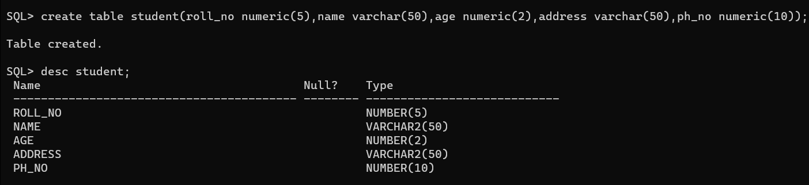

# EX 1 DATA DEFINITION LANGUGE COMMANDS IN RDBMS
## DATE:
## AIM:
To create a student database and execute DDL queries using SQL.

## DDL (Data Definition Language)

DDL or Data Definition Language actually consists of the SQL commands that can be used to define the database schema. It simply deals with descriptions of the database schema and is used to create and modify the structure of database objects in the database. DDL is a set of SQL commands used to create, modify, and delete database structures but not data. These commands are normally not used by a general user, who should be accessing the database via an application.

 
## List of DDL commands: 

CREATE: This command is used to create the database or its objects (like table, index, function, views, store procedure, and triggers).
DROP: This command is used to delete objects from the database.
ALTER: This is used to alter the structure of the database.
TRUNCATE: This is used to remove all records from a table, including all spaces allocated for the records are removed.
RENAME: This is used to rename an object existing in the database.

## Query:
### 1) Create a table student with the following fieds rollno,name,age,address,phoneno.
### SQL QUERY: 
create table student(roll_no numeric(5),name varchar(50),age numeric(2),address varchar(50),ph_no numeric(10));
### OUTPUT:

### 2) Change the above student table by adding another attribute department
### SQL QUERY: 
 alter table student add department varchar(5);
### OUTPUT:

### 3) Drop the student table
### SQL QUERY: 
drop table student;
### OUTPUT:

### 4) Delete the student table using truncate keyword
### SQL QUERY: 
 truncate table student;
### OUTPUT:

### 5) Rename the student table to mystudent
### SQL QUERY: 
alter table student rename to mystudent;
### OUTPUT:

## RESULT:
### To create a student database and execute DDL queries using SQL is executed successfully.
